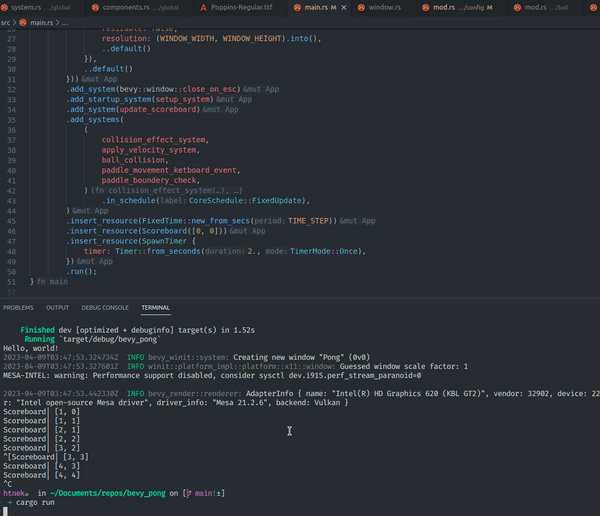

<h1 align="center"> 
Pong Game 🎾
</h1>

<p>
A implementation of the classic Pong game using the rust programming language🦀 and <a href="https://bevyengine.org/">bevy game engine</a>. The project is a very simple version of the original game and it was done in 4 days.

On this project it was used the ECS(Entity Component System) pattern to organize the game objects and the components that they have. The ECS pattern is a very good way to organize the game objects and it is very easy to implement in rust using the bevy game engine.

</p>

### Preview 👓

<p align="center">



</p>

### How to run 🏃‍♂️

There are some prerequisites to be able to install and compile a project with bevy, to make sure that everything is setm follow the steps on the bevy website: https://bevyengine.org/learn/book/getting-started/setup/.

Bellow the simple bash commands to run the cargo project:

```bash
# Clone this repository
$ git clone

# run cargo project on release mode
$ cargo run --release
```

> It can take a while to compile the project because of the number of dependencies, so be patient.

> Warning: the game was tested only on linux ubuntu.

### How to play 🎮

To play the game is very simple, eache paddle is controlled by a player and the goal is to make the ball miss the opponent paddle. The player that makes more points win the game.

Every time a point is scored the ball respawn at the center on a randow **y** position and will always move to the player that scored the point, before moving the ball be froze for 2 seconds.

**Movements**:

-   **Player 1**(Left):

    -   Move Up → **W**
    -   Move Down → **S**

-   **Player 2**(Direita):
    -   Move Up → **(up arrow)**
    -   Move Down → **(down arrow)**

### Features 🚀

-   [x] Paddle movement
-   [x] Ball movement
-   [x] Ball collision with paddles
-   [x] Ball collision with walls
-   [x] Score system
-   [x] Score ui display
-   [x] Ball respawn
-   [x] Ball freeze
-   [ ] Ball speed increase
-   [ ] Fix infinity paddle movement bug

### Tools 🛠

<p align="center">
    
</p>

### Contact 📫

<p align="center">
<a href="https://www.linkedin.com/in/luis-felipe-vanin-martins-5a5b38215">

</a>
<a href="mailto:luisfvanin2@gmail.com">

</a>
</p>
